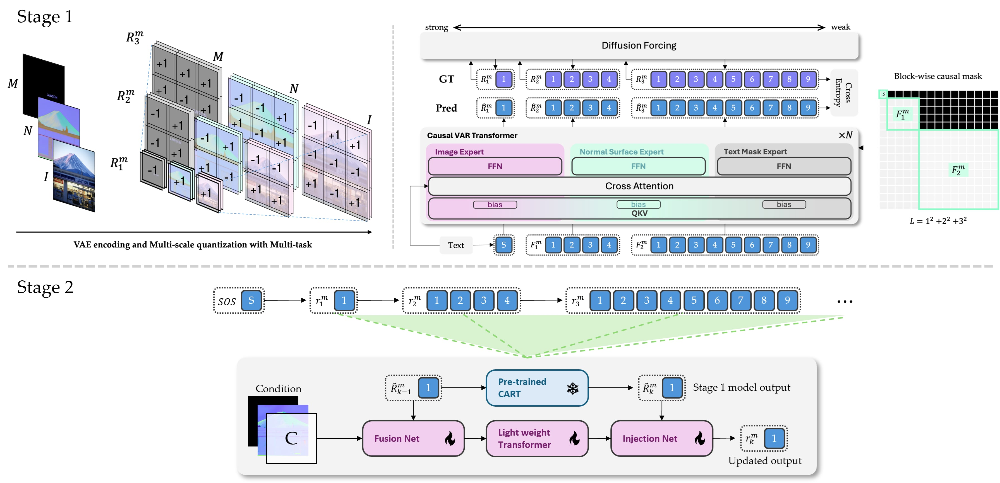

<div align="center">

# 🚀InfinityPilot: To Infinity and Beyond
</div>

## This work is based on:
- [Infinity ∞ : Scaling Bitwise AutoRegressive Modeling for High-Resolution Image Synthesis][1]
- [CAR🚗: Controllable AutoRegressive Modeling for Visual Generation][2]

Huge thanks to my senior [Theo the Bear] for all the support and advice.


## The model architecture
<p align="center">
  
  <br>
  <i>
        Architecture overview.
        Stage 1: The model is pretrained using text segmentation, normal maps, and original images, while sharing QKV weights across the three Transformers.  
        Stage 2: During inference, we integrate the CAR modules.
    </i>
</p>

## Training
```bash
./train_pilot.sh    # start training Pilot modules, aside from Infinity blocks.
```

## 📌 Progress Log
| Date   | Status🎈 / Update📃                                                            |
|--------|---------------------------------------------------------------------------------|
| 09/04  | [📃] Complete training dataset generation                                   |
| 09/12  | [🎈] Serving as a TA this semester, but still working on pushing the research forward. |
| 09/13  | [📃] Training pipeline stabilized; monitoring gradient norms and validation accuracy. |
| 09/14  | [📃] Implemented W&B logging for evaluation images.                         |


[1]: https://github.com/FoundationVision/Infinity
[2]: https://github.com/MiracleDance/CAR
[Theo the Bear]: https://github.com/theohsiung
[architecture]: ./assets/pilot_architecture.png