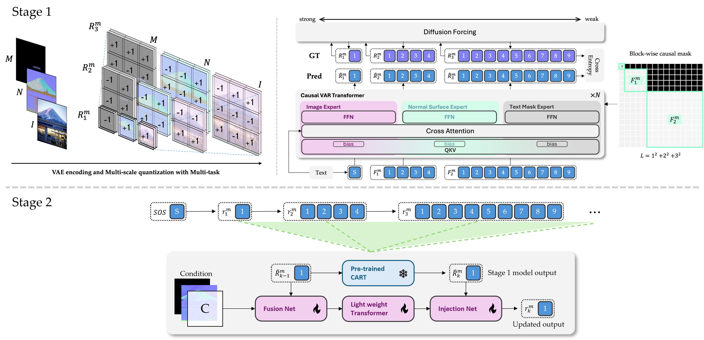

# InfinityPilot🚀
This work is based on:
- [Infinity ∞ : Scaling Bitwise AutoRegressive Modeling for High-Resolution Image Synthesis](https://github.com/FoundationVision/Infinity)  
- [CAR🚗: Controllable AutoRegressive Modeling for Visual Generation](https://github.com/MiracleDance/CAR)  

Huge thanks to my senior [Theo the Bear](https://github.com/theohsiung) for all the support and advice.

## The model architecture

> [Comment] 09/12 \
> Althought I have to be the TA this semester, still hoping this research could be done soon... 